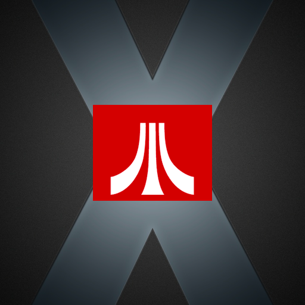
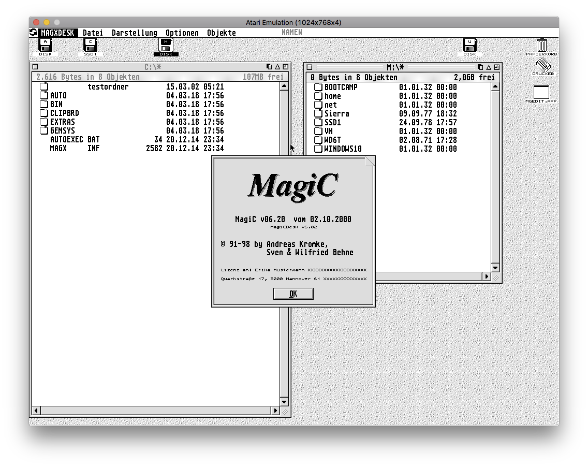
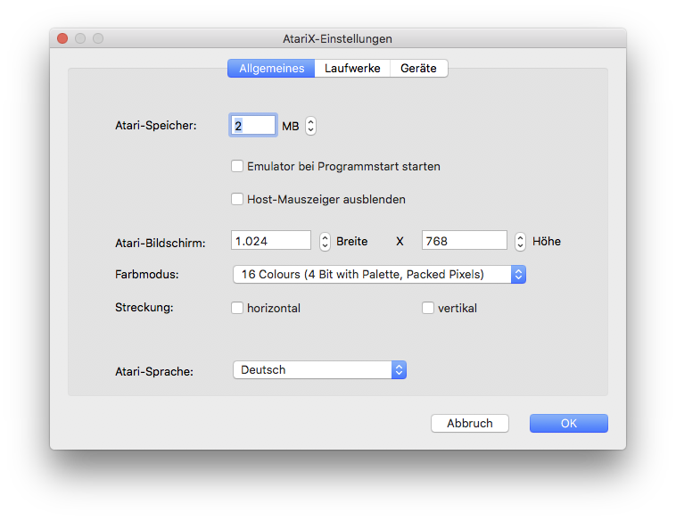
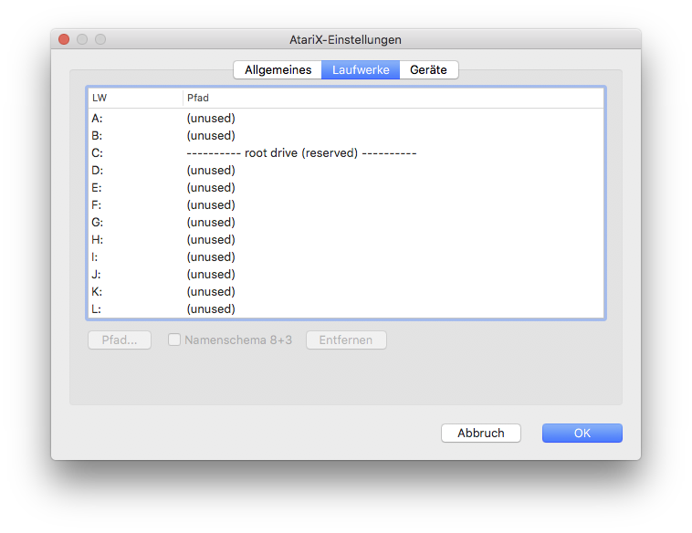
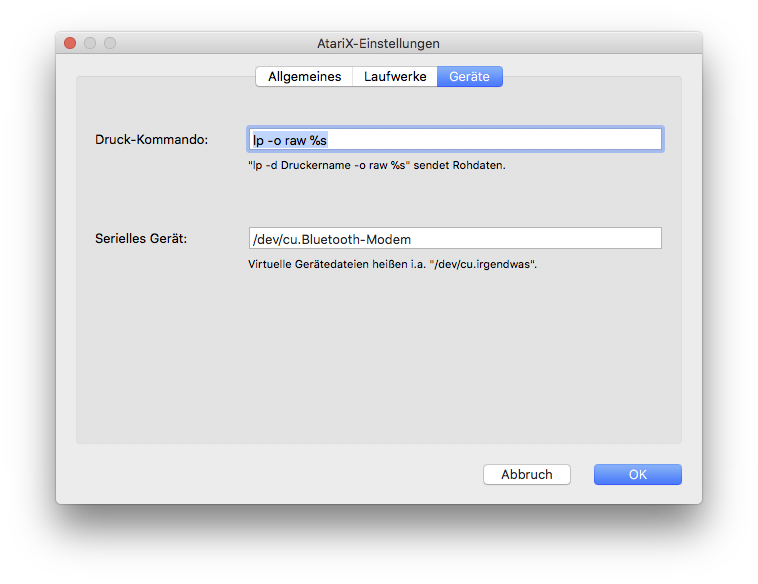

# AtariX for modern macOS

[](https://github.com/Dirk-Who/ATARIX64/actions/workflows/apple-silicon.yml)



AtariX is an Atari ST/TT-compatible emulation environment for macOS. This
repository continues the original AtariX code base and maintains it for
current 64-bit Macs, with the primary focus on native Apple Silicon systems.

The current public release is
[ATARIX-A64-0.6.6](https://github.com/Dirk-Who/ATARIX64/releases/tag/ATARIX-A64-0.6.6-Release).

- [Apple Silicon build instructions](APPLE_SILICON.md)
- [Current feature overview](FEATURES.md)
- [Development history](HISTORY.md)
- [Detailed German change log (PDF)](docs/AtariX_Aenderungen_0.3_bis_0.6.6.pdf)
- [Musashi integration notes](MUSASHI.md)

## Origin and attribution

The great majority of the AtariX code was written by **Andreas Kromke**, the
original author of MagiC, MagicMac, MagicMac X and AtariX. His copyright
notices remain preserved in the source files.

Project lineage:

1. [Andreas Kromke's original AtariX repository](https://gitlab.com/AndreasK/AtariX)
2. [Thorsten Otto's continuation](https://github.com/th-otto/AtariX), which
   contributed further fixes and support for newer toolchains
3. This independent modern-macOS continuation, maintained by **Dirk Werth**
   with development assistance from **OpenAI Codex**

This project is not an official new AtariX release by Andreas Kromke. It is an
independent continuation that retains the original licence and attribution.

Andreas Kromke's actively developed technical successor is
[MagicOnLinux](https://gitlab.com/AndreasK/magiclinux). Its HostXFS work and
other modernisations may also provide useful reference material for future
AtariX development.

## What AtariX 0.6.6 provides

- Native `arm64` application for Apple Silicon Macs running macOS 11 or newer
- Musashi-based MC68020 emulation, updated for the Apple Silicon port
- Resizable, HiDPI-aware and native macOS fullscreen display
- Arbitrary Atari screen sizes and colour depths, including 32-bit output
- Corrected RGB/VDI colour conversion and framebuffer byte-lane handling
- Correct mouse-coordinate mapping in windowed and fullscreen modes
- Smooth fullscreen mouse movement without the earlier performance regression
- Mouse-wheel and MacBook trackpad scrolling translated into Atari-compatible
  cursor-key events
- Writable macOS folders mapped as Atari drives
- Clipboard exchange between macOS and the emulated system
- German, French and English localisation
- Clean application shutdown when MagiC selects **Ausschalten**
- Reproducible Xcode and GitHub Actions build with ad-hoc code signing

See [FEATURES.md](FEATURES.md) for limitations and implementation details.

## First start

AtariX still uses the historical setup procedure:

1. Create a folder named `MAGIC_C`, preferably in your Documents folder.
2. Start AtariX.
3. Select that folder as the root drive. It appears as drive `C:` inside the
   emulation.
4. Initialise the drive and start the emulator.

Because the downloadable build is ad-hoc signed rather than Apple-notarised,
macOS may ask you to confirm that the externally downloaded application is
trusted on first launch.

## Building

The application requires Xcode and the SDL2 framework. The helper script
downloads the supported framework version:

```sh
./scripts/bootstrap-sdl2.sh
xcodebuild \
  -project src/AtariX-MT/AtariX/AtariX.xcodeproj \
  -scheme AtariX-Application \
  -configuration Release \
  -derivedDataPath build \
  ARCHS=arm64 \
  ONLY_ACTIVE_ARCH=NO \
  build
```

The result is created at:

```text
build/Build/Products/Release/AtariX.app
```

More details are available in [APPLE_SILICON.md](APPLE_SILICON.md).

## Screenshots






## Licence

AtariX is distributed under the **GNU General Public License version 3**. See
[LICENSE](LICENSE). Existing copyright notices in individual source files are
part of the project history and must be retained.

External components retain their respective licences:

- **Musashi 68k emulator** by Karl Stenerud — upstream source and licence:
  [kstenerud/Musashi](https://github.com/kstenerud/Musashi). The integrated
  revision and AtariX-specific changes are documented in [MUSASHI.md](MUSASHI.md).
- **SDL2** — distributed under the zlib licence. The framework's licence file
  is included with the downloaded SDL2 package; see the
  [SDL licensing information](https://www.libsdl.org/license.php).
- **Atari VDI drivers** by Wilfried and Sven Behne — included with permission.

## Reporting problems

Please use the [GitHub issue tracker](https://github.com/Dirk-Who/ATARIX64/issues)
and include the AtariX version, macOS version, Mac model, configured Atari
resolution/colour depth, and steps needed to reproduce the problem.
